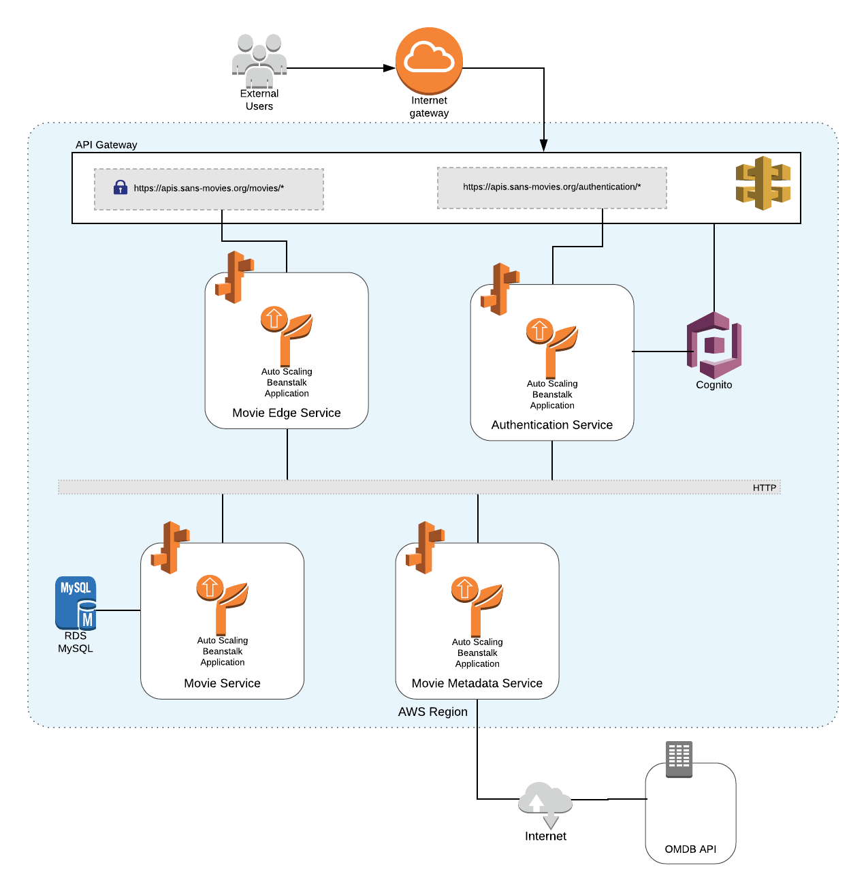

# Movie Application
Very small movie Application written using Microservice Architecture, consists of suite of stateless Microservices and Edge Services that allow you to store and retrive Movies. The Application is hosted on AWS and it's powered by some of AWS managed services including RDS, Cognito, Elastic Beanstalk, API Gateway and more.


- [Architecture](#architecture)
	- [Stack Summary](#stack-summary)
	- [Services](#services)
- [Public API Endpoints](#public-api-endpoints)
- [Project Roadmap](#project-roadmap)

## Architecture


### Stack Summary:
Elected Technology | Why 
---|---
PHP 7.1 | Is one of the main languages in SANS’s stack
Symfony Framework 4.2 | Very fast, highly extensible and overall Enterprise grade level
AWS RDS MySQL | Managed, easy to scale and claim to be faster than regular MySQL
AWS Cognito | Managed, quick integration with AWS API Gateway
AWS Elastic Beanstalk | Quick configuration and easy to scale
AWS Certificate Manager | Manage certificates for the app
AWS Route 53 | DNS Managemnt
Docker | To have the same environment across multiple Developers

### Services:
Name | Type | Purpose
---|---|---
[Movie Edge Service](https://github.com/mookofe/movie-edge-service) | Edge Service | Public facing service that proxy requests from external users to multiple Microservices.
[Authentication Service](https://github.com/mookofe/authentication-service)|Public Service|Provides user Authentication and Authorization to the system
[Movie Service](https://github.com/mookofe/movie-service) | Backend Service | Responsible of handling and persisting movies
[Movie Metadata Service](https://github.com/mookofe/movie-metadata-service) | Backend Service | Provide movie’s external metadata, IMDB ratings, pictures, etc 

## Public API Endpoints

### **List of endpoints:**

|URL|Method|Description|
---|---|---
**Authentication:**||
[https://apis.sans-movies.org/authentication/v1/login](#authenticate-user)|POST|Authenticate User
**Movies:**||
[https://apis.sans-movies.org/movies/v1/movies](#get-list-of-movies)|GET|Get list of movies
[https://apis.sans-movies.org/movies/v1/movies](#create-movie)|POST|Create movie
[https://apis.sans-movies.org/movies/v1/movies/{id}](#get-movie-details)|GET|Get movie details
[https://apis.sans-movies.org/movies/v1/movies/{id}](#update-movie)|PUT|Update Movie
[https://apis.sans-movies.org/movies/v1/movies/{id}](#delete-movie)|DELETE|Delete Movie

---
### Authenticate user:

```
POST https://apis.sans-movies.org/authentication/v1/login
```

**Payload:**

```
{
	"email": "admin@sans-movies.org",
	"password": "Passw0rd"
}
```

**Response:**

```
{
    "accessToken": "eyJraWQiOiI0XC9...",
    "expiresIn": 3600,
    "tokenType": "Bearer",
    "refreshToken": "eyJjdHkiOiJKV1QiLCJlbm...",
    "idToken": "eyJraWQiOiJXeEE5c2hLMVNI..."
}
```
---

### Get list of movies:
```
GET https://apis.sans-movies.org/movies/v1/movies?orderBy=releaseYear&orientation=asc&skip=0&limit=10
```

**Headers:**

Name|Type|Required|Description
---|---|---|---
Authorization|String|Yes| idToken from authentication endpoint

**Query Parameters:**

Name|Type|Required|Acepted values|Default|Description
---|---|---|---|---|---
orderBy|String|No|title,format,length,releaseYear,rating||Column name you want to order the list of movies
orientation|String|No|asc,desc||Ordering orientation, ascending or descending
skip|Integer|No|> 0|0|Number of rows to skip
limit|Integer|No|1-100|20|Number of rows to retreive

**Response:**

```
{
    "data": [
        {
            "id": 1,
            "title": "The Terminator",
            "format": "DVD",
            "length": 107,
            "releaseYear": 1984,
            "rating": 4
        },
        {
            "id": 2,
            "title": "Terminator 2: Judgment Day",
            "format": "DVD",
            "length": 137,
            "releaseYear": 1991,
            "rating": 5
        }
    ],
    "meta": {
        "skipped": 0,
        "totalRows": 2
    }
}
```
---
### Create movie:
```
POST https://apis.sans-movies.org/movies/v1/movies
```

**Headers:**

Name|Type|Required|Description
---|---|---|---
Authorization|String|Yes| idToken from authentication endpoint

**Payload:**

```
{
    "title": "Terminator 2: Judgment Day",
    "format": "DVD",
    "length": 137,
    "releaseYear": 1991,
    "rating": 5
}
```

**Body Parameters:**

Name|Type|Required|Acepted values|Default|Description
---|---|---|---|---|---
title|String|Yes|Lenth length between 1 and 50 characters]||Movie title
format|String|Yes|["VHS", "DVD", "Streaming"]||Movie format
length|Integer|Yes|0-500||Movie length in minutes
releaseYear|Integer|Yes|1800-2100||Movie release year
rating|Integer|Yes|1-5||Movie rating

**Response:**

```
{
    "id": 2,
    "title": "Terminator 2: Judgment Day",
    "format": "DVD",
    "length": 137,
    "releaseYear": 1991,
    "rating": 5,
    "metadata": {
        "rated": "R",
        "dateReleased": "1991-07-03T00:00:00+00:00",
        "genre": "Action, Sci-Fi",
        "director": "James Cameron",
        "writers": "James Cameron, William Wisher",
        "plot": "A cyborg, identical to the one who failed to kill Sarah Connor, must now protect her teenage son, John Connor, from a more advanced and powerful cyborg.",
        "posterUrl": "https://m.media-amazon.com/images/M/MV5BMGU2NzRmZjUtOGUxYS00ZjdjLWEwZWItY2NlM2JhNjkxNTFmXkEyXkFqcGdeQXVyNjU0OTQ0OTY@._V1_SX300.jpg",
        "imdbRating": 8.5,
        "rottenTomatoesRating": 93,
        "boxOffice": 198116802
    }
}
```

---

### Get movie details
```
GET https://apis.sans-movies.org/movies/v1/movies/{id}
```

**Headers:**

Name|Type|Required|Description
---|---|---|---
Authorization|String|Yes| idToken from authentication endpoint

**Query Parameters:**

Name|Type|Required|Description
---|---|---|---
id|Integer|Yes|Movie identifier

**Response:**

```
{
    "id": 2,
    "title": "Terminator 2: Judgment Day",
    "format": "DVD",
    "length": 137,
    "releaseYear": 1991,
    "rating": 5,
    "metadata": {
        "rated": "R",
        "dateReleased": "1991-07-03T00:00:00+00:00",
        "genre": "Action, Sci-Fi",
        "director": "James Cameron",
        "writers": "James Cameron, William Wisher",
        "plot": "A cyborg, identical to the one who failed to kill Sarah Connor, must now protect her teenage son, John Connor, from a more advanced and powerful cyborg.",
        "posterUrl": "https://m.media-amazon.com/images/M/MV5BMGU2NzRmZjUtOGUxYS00ZjdjLWEwZWItY2NlM2JhNjkxNTFmXkEyXkFqcGdeQXVyNjU0OTQ0OTY@._V1_SX300.jpg",
        "imdbRating": 8.5,
        "rottenTomatoesRating": 93,
        "boxOffice": 198116802
    }
}
```

---
### Update movie:
```
PUT https://apis.sans-movies.org/movies/v1/movies/{id}
```

**Headers:**

Name|Type|Required|Description
---|---|---|---
Authorization|String|Yes| idToken from authentication endpoint

**Query Parameters:**

Name|Type|Required|Description
---|---|---|---
id|Integer|Yes|Movie identifier

**Payload:**

```
{
    "title": "Terminator 2: Judgment Day",
    "format": "DVD",
    "length": 137,
    "releaseYear": 1991,
    "rating": 5
}
```

**Body Parameters:**

Name|Type|Required|Acepted values|Default|Description
---|---|---|---|---|---
title|String|Yes|Lenth length between 1 and 50 characters]||Movie title
format|String|Yes|["VHS", "DVD", "Streaming"]||Movie format
length|Integer|Yes|0-500||Movie length in minutes
releaseYear|Integer|Yes|1800-2100||Movie release year
rating|Integer|Yes|1-5||Movie rating

**Response:**

```
{
    "id": 2,
    "title": "Terminator 2: Judgment Day",
    "format": "DVD",
    "length": 137,
    "releaseYear": 1991,
    "rating": 5,
    "metadata": {
        "rated": "R",
        "dateReleased": "1991-07-03T00:00:00+00:00",
        "genre": "Action, Sci-Fi",
        "director": "James Cameron",
        "writers": "James Cameron, William Wisher",
        "plot": "A cyborg, identical to the one who failed to kill Sarah Connor, must now protect her teenage son, John Connor, from a more advanced and powerful cyborg.",
        "posterUrl": "https://m.media-amazon.com/images/M/MV5BMGU2NzRmZjUtOGUxYS00ZjdjLWEwZWItY2NlM2JhNjkxNTFmXkEyXkFqcGdeQXVyNjU0OTQ0OTY@._V1_SX300.jpg",
        "imdbRating": 8.5,
        "rottenTomatoesRating": 93,
        "boxOffice": 198116802
    }
}
```

---
### Delete movie:
```
DELETE https://apis.sans-movies.org/movies/v1/movies/{id}
```

**Headers:**

Name|Type|Required|Description
---|---|---|---
Authorization|String|Yes| idToken from authentication endpoint

**Query Parameters:**

Name|Type|Required|Description
---|---|---|---
id|Integer|Yes|Movie identifier

**Response:**

```
Status: 204 No Content
```

## Project Roadmap
ID | Description | % Completed
---|---|---
**1** | **Movie Service** |
1.1| &nbsp;&nbsp;&nbsp;&nbsp; Boilerplate setup | 100%
1.2| &nbsp;&nbsp;&nbsp;&nbsp; Create endpoint to list movies | 100%
1.3| &nbsp;&nbsp;&nbsp;&nbsp; Create endpoint to add movie | 100%
1.5| &nbsp;&nbsp;&nbsp;&nbsp; Create endpoint to view movie | 100%
1.5| &nbsp;&nbsp;&nbsp;&nbsp; Create endpoint to update movie | 100%
1.6| &nbsp;&nbsp;&nbsp;&nbsp; Create endpoint to delete movie | 100%
**2**|**External Reference Service** | 
2.1| &nbsp;&nbsp;&nbsp;&nbsp; Boilerplate setup | 100%
2.2| &nbsp;&nbsp;&nbsp;&nbsp; Endpoint to get movie external data (Ratings, BoxOffice and more) | 100%
*3*|**Authentication Service** | 
3.1| &nbsp;&nbsp;&nbsp;&nbsp; Boilerplate setup | 100%
3.2| &nbsp;&nbsp;&nbsp;&nbsp; Create cognito user pool | 100%
3.3| &nbsp;&nbsp;&nbsp;&nbsp; Add login endpoint | 100%
**4**|**Movie Edge Service** | 
4.1| &nbsp;&nbsp;&nbsp;&nbsp; Boilerplate setup | 100%
4.2| &nbsp;&nbsp;&nbsp;&nbsp; Integrate authentication | 100%
4.3| &nbsp;&nbsp;&nbsp;&nbsp; Proxy endpoints | 100%
5|Create docker configuration | 0%
6|Setup CloudFormation to deploy infrastructure | 0%
7|Add unit-test  | ~20%
